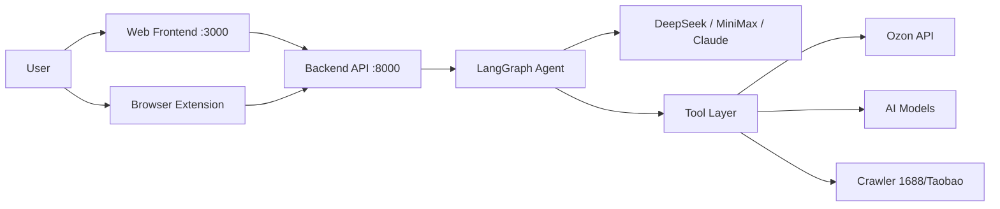
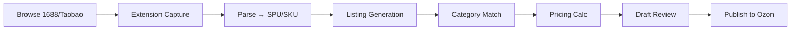

# iCross Agent

AI-powered e-commerce operations system for **[Ozon](https://www.ozon.ru)** (Russian marketplace). Automates product sourcing, listing generation, pricing, advertising, and finance management through a conversational AI Agent interface.

> **🌐 中文用户？** 查看 [README_CN.md](README_CN.md) — 中文安装指南和使用说明。
>
> **🎮 Demo mode** — Set `ICROSS_DEMO_MODE=true` in `.env` to explore the UI without API keys.



## Quick Start

### Prerequisites

- **Python** 3.11+
- **Node.js** 18+
- **uv** (recommended) — [install uv](https://docs.astral.sh/uv/getting-started/installation/)

### One-click Start

Choose your platform:

<details>
<summary><b>🐳 Docker (easiest — no Python/Node.js needed)</b></summary>

```bash
git clone https://github.com/Jason-prd/icross-agent.git
cd icross-agent

# 1. Edit .env with your API keys
cp .env.example .env
# then edit .env

# 2. Start everything with one command
docker compose up -d
```

| Service | URL | Description |
|---------|-----|-------------|
| Frontend | http://localhost:3000 | React operations console |
| Backend API | http://localhost:8000 | FastAPI + WebSocket |
| API Docs | http://localhost:8000/docs | Swagger UI |

</details>

<details>
<summary><b>🪟 Windows (batch script)</b></summary>

```batch
git clone https://github.com/Jason-prd/icross-agent.git
cd icross-agent

:: Edit .env with your API keys, then double-click:
start.bat
```

Or from Command Prompt:
```batch
start.bat
```

The script auto-detects Python 3.11+ and Node.js 18+, creates a virtual environment, installs all dependencies, and starts both servers.

</details>

<details>
<summary><b>🐧 macOS / Linux (bash script)</b></summary>

```bash
git clone https://github.com/Jason-prd/icross-agent.git
cd icross-agent

# Edit .env with your API keys, then:
./start.sh
```

</details>

All scripts automatically:
1. Create `.env` from `.env.example` if missing — edit this file first
2. Install all Python dependencies (`uv sync` or pip fallback)
3. Install frontend dependencies (`npm install`)
4. Start both servers, kill old processes on same ports

| Service | URL | Description |
|---------|-----|-------------|
| Frontend | http://localhost:3000 | React operations console |
| Backend API | http://localhost:8000 | FastAPI + WebSocket |
| API Docs | http://localhost:8000/docs | Swagger UI |

## Environment Configuration

Copy `.env.example` to `.env` and fill in your API keys:

```env
# Required: at least one LLM provider
DEEPSEEK_API_KEY=sk-...              # DeepSeek (primary, fast/default tier)
MINIMAX_API_KEY=sk-...               # MiniMax (main agent LLM)

# Required: Ozon marketplace
OZON_CLIENT_ID=...
OZON_API_KEY=...

# Optional
ANTHROPIC_API_KEY=sk-ant-...         # Claude (backup)
OPENAI_API_KEY=sk-...                # OpenAI (backup)
VOLC_ACCESS_KEY=...                  # Seedream image generation
```

### Getting API Keys

| Service | Where to Get |
|---------|-------------|
| **DeepSeek** | https://platform.deepseek.com/api_keys |
| **MiniMax** | https://platform.minimaxi.com — create API key + group ID |
| **Ozon** | Seller Center → Settings → API → generate key pair |
| **Anthropic** | https://console.anthropic.com |
| **VolcEngine** | https://console.volcengine.com/key-manager |

## Daily Usage

### AI Agent (核心交互方式)

The Agent is the main interaction paradigm. Type natural language:

```
列出所有待审核草稿
为 XX 产品生成俄语 Listing
查看本月利润分析
检查广告活动效果
从1688搜索蓝牙耳机
```

The Agent shows every step — thinking → tool calls → results — keeping full transparency.

### Product Sourcing Flow



**Two ways to capture products:**

1. **Browser Extension**: Right-click on product page → "Capture to iCross"
2. **Agent Chat**: Paste product URL or description → ask Agent to process

### Web Console Pages

| Page | Module | Description |
|------|--------|-------------|
| **Agent** | AI Chat | Conversational Agent interface |
| **Dashboard** | Overview | Sales charts, auto-pilot status, KPIs |
| **Hub / 选品** | Sourcing | Browse sourced products |
| **Products** | Product Mgmt | View and manage products |
| **Drafts / 草稿审核** | Draft Review | Review AI-generated listings before publish |
| **Orders** | Order Mgmt | FBO / FBS / rFBS orders |
| **Finance / 财务中心** | Finance | Transactions, daily sales, profit analysis |
| **Marketing / 营销广告** | Ads | Ad campaigns, promotions |
| **Service / 客服中心** | Customer Service | Buyer chats, Q&A, reviews |
| **Returns / 退货中心** | Returns | Return requests, claims |
| **AutoPilot / 自动运营** | Automation | Auto-pricing scheduler, workflow rules |
| **Reports / 报表中心** | Reports | Async report generation |
| **Settings** | Config | Shop settings, LLM providers, notifications |

### Browser Extension Setup

1. Open Chrome → `chrome://extensions`
2. Enable **Developer mode** (top right)
3. Click **Load unpacked** → select `frontend-extension/`
4. Click the extension icon → **Settings** → set Server URL to `http://localhost:8000`
5. Browse 1688 / Taobao / Pinduoduo → right-click → **Capture to iCross**

## Manual Setup

If you prefer to start components separately:

```bash
# Terminal 1: Backend
cd icross-agent
cp .env.example .env          # edit your keys
uv sync
PYTHONPATH=src uv run uvicorn icross.api.main:app --host 0.0.0.0 --port 8000 --reload

# Terminal 2: Frontend
cd frontend-react
npm install
npx vite --port 3000 --strictPort
```

## Project Structure

```
src/icross/
├── api/                # FastAPI + REST routers
├── agents/
│   ├── master/         # LangGraph agent + tools
│   └── llm/            # Multi-LLM factory (ProviderTransport pattern)
├── services/
│   └── ozon/           # Ozon API client
├── core/storage/       # JSON file storage
frontend-react/         # React 18 + Vite + Ant Design 5
frontend-extension/     # Chrome Extension MV3
data/                   # Runtime JSON data files (auto-generated)
```

## Tech Stack

| Layer | Technology |
|-------|------------|
| Agent Framework | LangGraph (`create_react_agent`) |
| LLM | DeepSeek / MiniMax / Claude (multi-model routing) |
| Web Framework | FastAPI + WebSocket |
| Frontend | React 18 + TypeScript + Vite + Ant Design 5 |
| Data Storage | JSON files (no database required) |
| Image Generation | Seedream API / rembg |
| Browser Extension | Chrome MV3 (vanilla JS) |
| Notifications | Feishu (lark-oapi) |

## License

MIT
